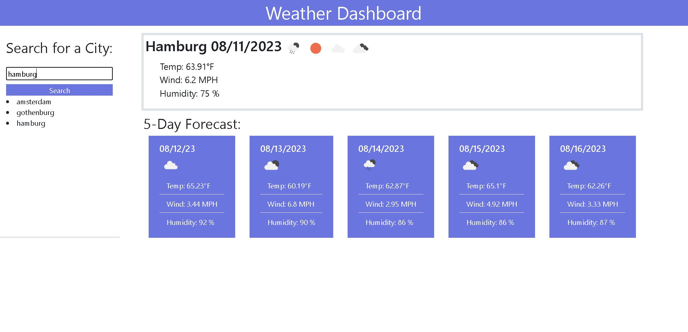

# Weather App

## Description

This is a simple weather app that can show you the weather forecast for different cities! I wanted to make this app so that I could practice using third party APIs. Being able to use an API to get weather data from all over the world is really cool! The problem this app solves is the problem of finding accurate weather data quickly. With this app, you can instantly get the weather forecast for any city. While making this app, I learned a lot about how to use third party APIs and how to use their data with my project. I got more practice with jQuery and bootstrap as well. With that being said, I still have more to learn, because there are still a handful of bugs in this weather app. The main issue is that your search history disappears on refresh, and you cannot click on your search history to get that city's weather. I intend to fix these bugs in the future once I learn more about local storage. There is also an issue with the weather icons.

## Usage

You can find the weather app [here.](https://breeprimmer.github.io/weather-app/)

To use the weather app, simply search for a city in the search bar, and the weather forecast will appear for that city! Your searched city will also appear in your search history on the left side of the screen, so you can remember what cities you've already viewed the weather for.

There are weather icons representing the current weather for that day. The current day is at the top, and the next five days are the blue cards underneath. Each day will tell you information about the temperature, the wind speed, and the humidity percentage.

Have fun seeing the different types of weather in different cities!

## Credits

"How do I make an HTML text box show a hint when empty?" From Stack Overflow
https://stackoverflow.com/questions/108207/how-do-i-make-an-html-text-box-show-a-hint-when-empty

"JavaScript: Load an image from url and display" from stack Overflow
https://stackoverflow.com/questions/17634019/javascript-load-an-image-from-url-and-display